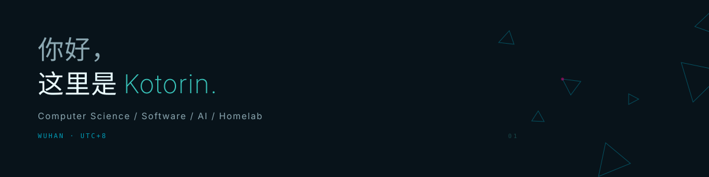

<picture>
  <source media="(prefers-color-scheme: dark)" srcset="assets/profile-dark.svg">
  <source media="(prefers-color-scheme: light)" srcset="assets/profile-light.svg">
  
</picture>

<sub>[home.kotorin.cn](https://home.kotorin.cn) &nbsp;·&nbsp; [Repositories](https://github.com/Kotorin-Kawaii?tab=repositories) &nbsp;·&nbsp; [kotorinkawaii@gmail.com](mailto:kotorinkawaii@gmail.com)</sub>

<br>

### `$ whoami`

计算机科学与技术本科在读。

平时主要写 Python 和 React，也会碰 Java、Vue、React Native。Linux、服务器、网络和硬件基本都愿意折腾。

最近大部分时间都在做 AI 角色相关的东西。比较喜欢折腾那些要自己保存状态、记忆和上下文，跑久了以后才开始有点意思的部分。

经常是从「我试试看能不能做」开始，然后莫名其妙多出一个项目。下面这两个做到后面，都变成在研究「AI 不说话的时候到底在干嘛」了。

<br>

<sub>PROJECT 01 &nbsp;·&nbsp; ACTIVE / PUBLIC</sub>

### KAngel Virtual Streamer

最开始只是想做个能在网页直播间里回复弹幕的超天酱。

现在已经变成一个一直在跑的 AI 主播后端，里面有主播状态、观众关系、长期记忆、直播上下文，还有一堆为了防止模型乱来的限制和恢复逻辑。

做着做着，明显比一开始想的复杂多了。

<sub>Python · FastAPI · WebSocket · SQLite · LLM · Memory · Realtime</sub>

[Source](https://github.com/Kotorin-Kawaii/KAngel-Virtual-Streamer) &nbsp;·&nbsp; [Live](https://kotorin-kawaii.github.io/KangelAI/)

<br>

<sub>PROJECT 02 &nbsp;·&nbsp; ACTIVE / PRIVATE</sub>

### Pocket Ame / 口袋糖糖

KAngel 是直播间里的 AI。糖糖想解决的是另一件事：如果用户没有发消息，她在干嘛？

所以这个项目里会有活动、计划、世界状态和长期记忆，她也会主动找用户，而不是永远等着 `on_user_message()`。

我不太想让一个 AI 的大部分人生都是：

```text
WAITING_FOR_USER_MESSAGE
```

目前还在开发，后端比前端成熟得多。

<sub>React Native · Python · LLM · Memory · Autonomy</sub>

<br>

### 平时在折腾的东西

```text
VOCALOID      MIKU
SYSTEM        LINUX
LAB           HOMELAB
HARDWARE      ENOUGH*
CURRENT       AI CHARACTERS
```

<sub>* obviously not enough</sub>

除了上面这些，还喜欢老电脑和音频设备，以及各种买了不一定用得上的硬件。

<details>
<summary>平时在用的东西</summary>

<br>

Python / TypeScript / React / Vue<br>
FastAPI / Spring Boot<br>
SQLite / MySQL<br>
Linux / Docker / Nginx

Python 写得最多。Java 能写，但目前还是 Python 顺手很多。

服务器和网络本来没必要懂这么多，最后还是越折腾越多。

</details>

<br>

<sub>先这样，后面想到什么再改。</sub>

<sub>Kotorin · 2026 · `status: still building`</sub>
