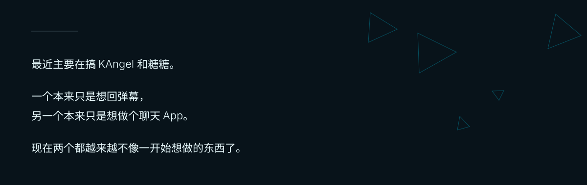
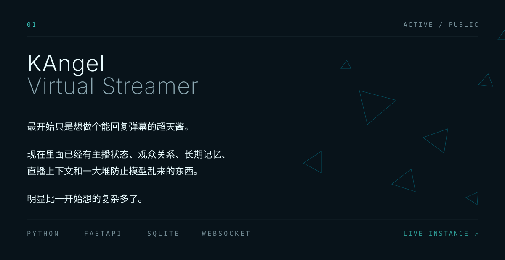
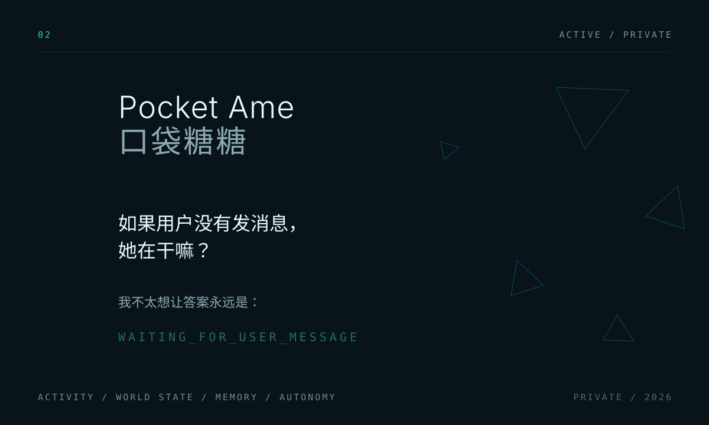
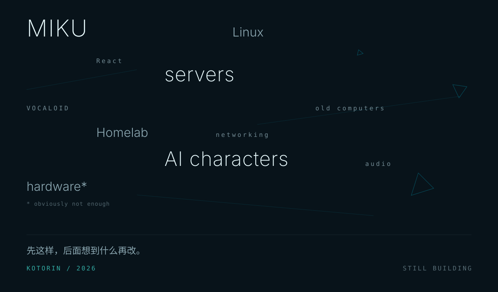

<picture>
  <source media="(max-width: 600px)" srcset="assets/blank.svg">
  <source media="(prefers-color-scheme: dark)" srcset="assets/profile-dark.svg">
  <source media="(prefers-color-scheme: light)" srcset="assets/profile-light.svg">
  
</picture>

<picture>
  <source media="(min-width: 601px)" srcset="assets/blank.svg">
  <source media="(prefers-color-scheme: dark)" srcset="assets/profile-mobile-dark.svg">
  <source media="(prefers-color-scheme: light)" srcset="assets/profile-mobile-light.svg">
  
</picture>

<picture>
  <source media="(max-width: 600px)" srcset="assets/blank.svg">
  <source media="(prefers-color-scheme: dark)" srcset="assets/about-dark.svg">
  <source media="(prefers-color-scheme: light)" srcset="assets/about-light.svg">
  
</picture>

<picture>
  <source media="(min-width: 601px)" srcset="assets/blank.svg">
  <source media="(prefers-color-scheme: dark)" srcset="assets/about-mobile-dark.svg">
  <source media="(prefers-color-scheme: light)" srcset="assets/about-mobile-light.svg">
  
</picture>

<a href="https://kotorin-kawaii.github.io/KangelAI/">
<picture>
  <source media="(max-width: 600px)" srcset="assets/blank.svg">
  <source media="(prefers-color-scheme: dark)" srcset="assets/kangel-dark.svg">
  <source media="(prefers-color-scheme: light)" srcset="assets/kangel-light.svg">
  
</picture>
</a>

<a href="https://kotorin-kawaii.github.io/KangelAI/">
<picture>
  <source media="(min-width: 601px)" srcset="assets/blank.svg">
  <source media="(prefers-color-scheme: dark)" srcset="assets/kangel-mobile-dark.svg">
  <source media="(prefers-color-scheme: light)" srcset="assets/kangel-mobile-light.svg">
  
</picture>
</a>

<picture>
  <source media="(max-width: 600px)" srcset="assets/blank.svg">
  <source media="(prefers-color-scheme: dark)" srcset="assets/pocket-ame-dark.svg">
  <source media="(prefers-color-scheme: light)" srcset="assets/pocket-ame-light.svg">
  
</picture>

<picture>
  <source media="(min-width: 601px)" srcset="assets/blank.svg">
  <source media="(prefers-color-scheme: dark)" srcset="assets/pocket-ame-mobile-dark.svg">
  <source media="(prefers-color-scheme: light)" srcset="assets/pocket-ame-mobile-light.svg">
  
</picture>

<picture>
  <source media="(max-width: 600px)" srcset="assets/blank.svg">
  <source media="(prefers-color-scheme: dark)" srcset="assets/traces-dark.svg">
  <source media="(prefers-color-scheme: light)" srcset="assets/traces-light.svg">
  
</picture>

<picture>
  <source media="(min-width: 601px)" srcset="assets/blank.svg">
  <source media="(prefers-color-scheme: dark)" srcset="assets/traces-mobile-dark.svg">
  <source media="(prefers-color-scheme: light)" srcset="assets/traces-mobile-light.svg">
  
</picture>

[kotorin.cn](https://kotorin.cn) &nbsp;·&nbsp; [Repositories](https://github.com/Kotorin-Kawaii?tab=repositories) &nbsp;·&nbsp; [kotorinkawaii@gmail.com](mailto:kotorinkawaii@gmail.com)
